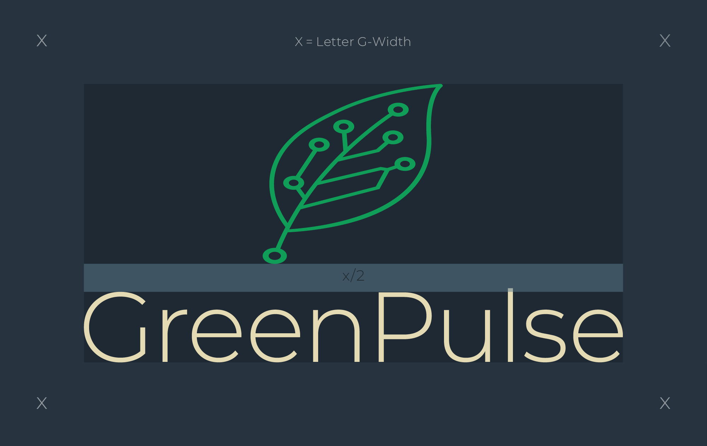
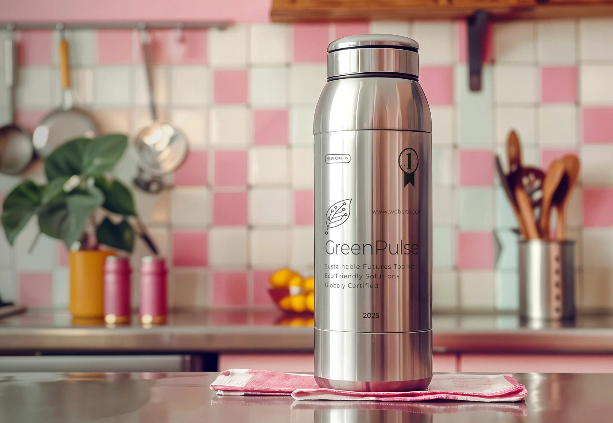

# greenpulse UI Gallery
This document contains visual assets from the brand kit.
<table>
  <tr>
    <td width="50%" valign="top" align="center">
      logo horizontal 1 ⬇️  
      
    </td>
    <td width="50%" valign="top" align="center">
      horizontal grid system 2 ⬇️  
      
    </td>
  </tr>
  <tr>
    <td width="50%" valign="top" align="center">
      logo vertical 3 ⬇️  
      
    </td>
    <td width="50%" valign="top" align="center">
      vertical grid system 4 ⬇️  
      
    </td>
  </tr>
  <tr>
    <td width="50%" valign="top" align="center">
      business card 5 ⬇️  
      
    </td>
    <td width="50%" valign="top" align="center">
      brand identity 6 ⬇️  
      
    </td>
  </tr>
  <tr>
    <td width="50%" valign="top" align="center">
      billboard 7 ⬇️  
      
    </td>
    <td width="50%" valign="top" align="center">
      book 8 ⬇️  
      
    </td>
  </tr>
  <tr>
    <td width="50%" valign="top" align="center">
      board 9 ⬇️  
      
    </td>
    <td width="50%" valign="top" align="center">
      book 10 ⬇️  
      
    </td>
  </tr>
  <tr>
    <td width="50%" valign="top" align="center">
      tote bag 11 ⬇️  
      
    </td>
    <td width="50%" valign="top" align="center">
      glass bottle 12 ⬇️  
      
    </td>
  </tr>
  <tr>
    <td width="50%" valign="top" align="center">
      steel bottle 13 ⬇️  
      
    </td>
    <td width="50%" valign="top" align="center">
      hoodie 14 ⬇️  
      
    </td>
  </tr>
  <tr>
    <td width="50%" valign="top" align="center">
      cap 15 ⬇️  
      
    </td>
    <td width="50%" valign="top" align="center">
      box 16 ⬇️  
      
    </td>
  </tr>
  <tr>
    <td width="50%" valign="top" align="center">
      Color pallete and tints 17 ⬇️  
      
    </td>
    <td width="50%" valign="top" align="center">
      Typography 18 ⬇️  
      
    </td>
  </tr>
</table>

  

---
*Total assets: 18 • Last updated: 2025-10-05 14:18 UTC+3*
